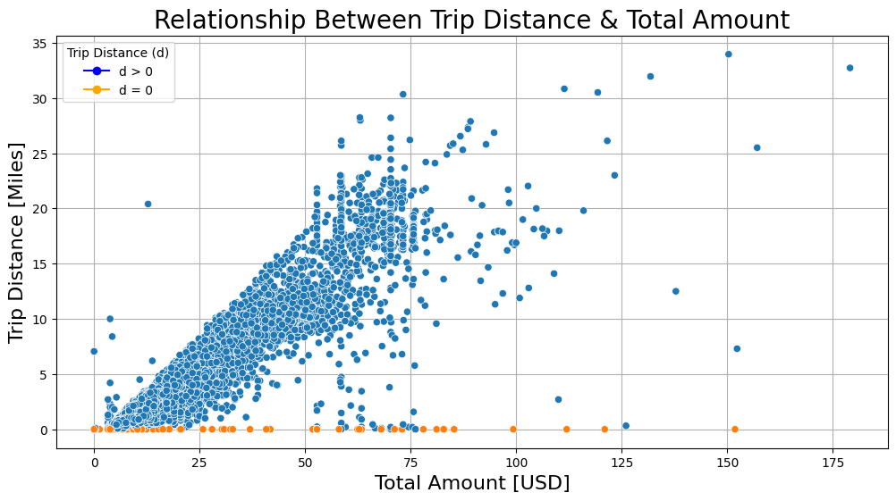
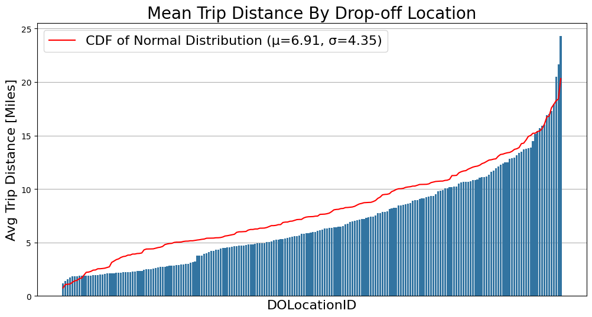

# NYC Taxi Fare Prediction and Tipping Behavior Analysis

This project develops predictive models for taxi fare estimation and tipping behavior analysis, using data provided by the NYC Taxi & Limousine Commission. The project employs regression and machine learning techniques to provide actionable insights for increasing revenue and understanding passenger tipping patterns.

## Project Overview

The NYC Taxi & Limousine Commission would benefit from a predictive model for estimating taxi fares and identifying tipping behavior. This project involved initial data exploration, cleaning, statistical testing and model building using multiple linear regression (MLR) and machine learning approaches. The models deliver accurate fare predictions and offer insights into tipping behaviors, which could potentially help drivers increase their revenue.

## Business Understanding

The primary stakeholders for this project are the NYC Taxi & Limousine Commission and New York City taxi drivers. The objective is to forecast taxi fares prior to each ride and to identify strategies for increasing driver revenue. By predicting fare amounts and analyzing tipping behaviors, we aim to optimize fare pricing and service strategies, which could lead to higher earnings for drivers and better experiences for passengers.

## Data Understanding

The dataset used for this project comes from [NYC.gov](https://www.nyc.gov/site/tlc/about/tlc-trip-record-data.page) and includes detailed records of taxi trips, such as trip distance, ride duration, total fare amount and payment method. The data was provided by the NYC Taxi & Limousine Commission and covers a comprehensive timeframe. Key insights from the exploratory data analysis (EDA) include:
- Identification of outliers, such as trips with recorded costs but zero distance.
- Even geographical distribution of drop-off points despite the absence of specific location data.
- Identification of trip distance and total fare amount as critical variables for fare prediction.

Visualizations, including the relationship between the trip distance and the total amount above and the distribution for the average trip distances below, help illustrate the data's characteristics.

## Modeling and Evaluation

### Regression Analysis

A multiple linear regression (MLR) model was developed to estimate taxi fares before the journey begins. Key insights from the regression analysis include:
- Trip distance emerged as the most influential predictor of fare amounts.
- On average, fares increase by about $9.5 for each additional mile and $9 for each additional minute when distance is controlled.
- Model performance metrics:
  - R²: 0.85
  - MAE (Mean Absolute Error): 2.45
  - MSE (Mean Squared Error): 16.15
  - RMSE (Root Mean Squared Error): 4.02

### Machine Learning Model for Tipping Prediction

A machine learning model was created to identify "generous" tippers—passengers who tip 20% or more. Key findings include:
- Factors like trip route, estimated fare and time of travel are significant predictors of tipping behavior.
- The model achieved an F1 score of 72%, offering good precision and recall in identifying generous tippers.
- Comparison between Random Forest and XGBoost models indicated both were suitable, with slight variations in performance.

The model is ready for beta testing with taxi drivers, with potential improvements including additional features like trip distance categorization and historical tipping data.

## Statistical Review

To investigate the relationship between fare amounts and payment methods, an A/B test was conducted:
- Customers were divided into two groups based on payment method (credit card vs. cash).
- A two-sample t-test revealed a statistically significant difference in average fare amounts between the two groups, with credit card users paying higher fares on average.
- The findings suggest that promoting credit card payments could boost driver revenues.

## Conclusion

The predictive models developed in this project provide accurate fare estimates and insights into tipping behavior, which can help optimize driver strategies. Recommendations include:
- Encouraging the use of credit cards among passengers to increase fare amounts.
- Using the tipping prediction model to offer targeted incentives for trips likely to result in generous tips.
- Further analysis with a larger dataset and additional features could enhance model performance.

Future work includes integrating clustering techniques for deeper insights, refining the tipping prediction model and expanding the analysis to cover more variables impacting fare and tip amounts.
